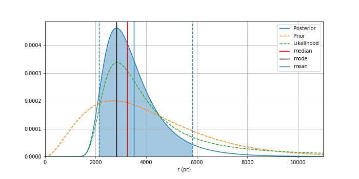

# Parallax-GAIA-EDR3
Find distance from parallax using Bayesian Statistics

Parallax.ipynb is the basic program for computing distance with their uncertainties (90% Credible interval).
I used two prior, uniform distance and Exponentially Decreasing space density with scale length 1350 pc.

Parallax-Copy1.ipynb is the automation for 10 random stars from GAIA-EDR3 Catalogue

Some beautiful result :)

This project is a hands-on from International Virtual Course: International Summer school on Astrostatistics and Machine Learning, ITB, 2-13 August 2021.
