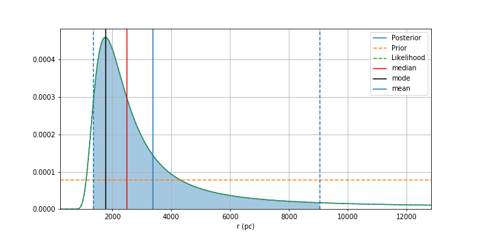

# Parallax-GAIA-EDR3
Find distance from parallax using Bayesian Statistics

Parallax.ipynb is the basic program for computing distance with their uncertainties.
Parallax-Copy1.ipynb is the automation for 10 random stars from GAIA-EDR3 Catalogue

Some beautiful result :)

